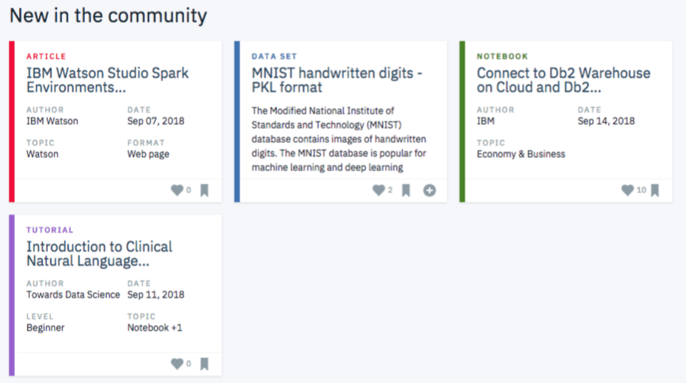

# Recommendations with IBM
## Introduction
In this project, I analysed the interactions that users have with articles on the IBM Watson Studio platform, and made recommendations to them about new articles you think they will like. Below it is an example of what the dashboard could look like displaying articles on the IBM Watson Platform. 

  

## Project Outline
This project is divided into the following tasks:

1. **Exploratory Data Analysis:** Explore the data and perform descriptive analysiss
2. **Rank Based Recommendations:** Find the most popular articles simply based on the most interactions and the articles we might recommend to new users
3. **User-User Based Collaborative Filtering:** Look at users that are similar in terms of the items they have interacted with and recommended these items to the similar users.
4. **Matrix Factorization:** Use machine learning approach to make article recommendations to the users by building out a matrix decomposition.

## Results
- The data set was highly imbalance because of very few interactions on the platform.
- Overfitting: The model trained on training data did not generalize well on test data. The accuracy curve of the test set is the inverse of the training set. The explanation for this is that, increasing latent features causes overfitting during training. Although it might seem like fewer latent features is better, the high accuracy is actually misleading due to class imbalance.

## Future Improvements
1. **Content Based Recommendations:** Leverage Natural Language Processing to perform a ranking of the highest ranked articles associated with some term. 
2. **A/B Testing:** Use an A/B test to measure and compare the effectiveness of any two recommendation systems